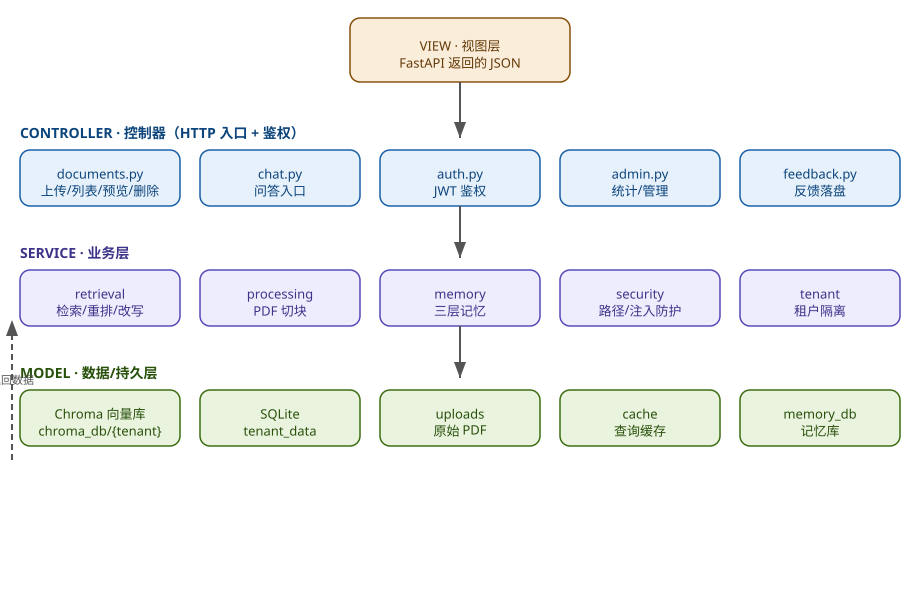
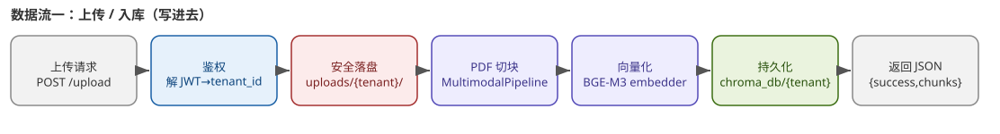
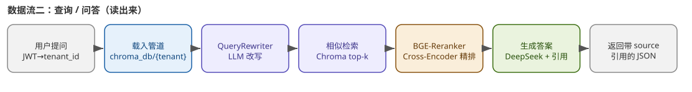

# 项目吃透指南（Student Notes）

> 本文档整理自对项目 `legal-doc-rag` 的评估，目的是帮助开发者（尤其是面试准备者）从"能跑 demo"到"能吃透、能讲透"这个中文法律文书 RAG 系统。

---

## 一、现状评估（诚实版）

| 维度 | 评价 | 说明 |
|------|------|------|
| **工程完整度** | 强 | 混合检索 / 三层记忆 / 多租户 / 真 JWT+限流+TLS / 单测+集成+评测三层测试 / Docker / 观测，比多数面试 RAG demo 扎实 |
| **业务贴合度** | 强（优势） | 上传法规/合同/文书 → 带引用问答，直接对应法务「法规检索 + 合同审查 + 出具带出处意见」 |
| **检索真实性** | 强 | BM25 + Dense + RRF 召回 + `BGE-Reranker` 真 Cross-Encoder 精排（懒加载 + 优雅降级），不是嘴上 hybrid |
| **多模态真实性** | 中 | PyMuPDF + OCR（PaddleOCR）+ 视觉描述管线存在，但重（CPU/模型依赖），部分部署会退化成纯文字 |
| **评测真实性** | ⚠️ 框架有、跑得少 | 31 条 golden 集 + RAGAS 框架已落地，但真实 RAGAS 评分默认 skip（需 key），别声称"评测充分" |
| **安全** | ⚠️ 有历史债 | 真 JWT / 限流 / TLS 已补；但 Volces embedding key 曾硬编码进源码 = 已泄露，部署前必须轮换 |
| **多租户 / 角色** | 中 | SQLite role 字段 + 每租户独立目录 / 向量库；简单可用，但没讲并发 / 水平扩展 |
| **数据真实性** | 强（优势） | 用真实上传的 PDF 跑，不是 mock 数据，这点比造数据项目更可信 |

### 最大的面试雷区

1. **Embedding key 硬编码泄露史** —— 被问"你做过安全加固吗"要诚实：曾把 Volces key 写进源码（= 已泄露），本轮已移除并改读环境变量，但"部署前必须去平台轮换"。别假装没发生过。
2. **"评测"别吹满** —— 框架在、golden 集只有 31 条、真实 RAGAS 默认 skip。正确说法："我搭了 RAGAS 评测管线 + 31 条回归集，真实评分在有 key 时跑，默认离线校验 harness，确保不回归。"
3. **多模态别当标配** —— OCR / 视觉模型重，可能退化。讲清"何时走多模态、何时纯文字"。
4. **"混合检索"被追问 Cross-Encoder 是否真加载** —— 答：`BGE-Reranker` 懒加载，不可用时优雅跳过（RRF 结果直接当 Top-K），所以即使 reranker 没起来，系统仍可用。

---

## 二、如何吃透：四层理解法

不要背代码，按这四层建立"能讲出来"的认知。

### 第 1 层｜架构层（能白板画出）

- 分层：用户层（前端 / Streamlit / SSE）→ 安全层（JWT 校验 + 限流 + TLS + 错误统一处理）→ 应用层（FastAPI：`auth`/`documents`/`chat`/…）→ 核心层（检索 / 记忆 / 处理 / 评测）→ 基础设施（ChromaDB 向量库 / Redis 记忆 / 模型服务 DeepSeek + BGE-M3）
- 关键文件：`app/main.py`（装配 + 限流器注册）、`docker-compose.yml`（拓扑：app + redis）、`app/retrieval/hybrid_retriever.py`（检索核心）

### 第 2 层｜数据流层（一条请求的生命周期）

**文档 ingestion（上传 → 入库）：**

```
上传 PDF → [安全] JWT + 限流 → 落盘（按租户目录）
        → PDF 提取（PyMuPDF 文字 + 图片坐标）
        → OCR（PaddleOCR）/ 视觉描述（可选多模态）
        → 分块（≈500 字符）
        → Embedding（BGE-M3，1024 维）→ 写入 ChromaDB（每租户独立集合）
        → Shadow Worker 异步：摘要（中期记忆）+ 实体画像
```

**问答 query（一次 RAG 链路）：**

```
POST /api/chat（Bearer）→ [安全] JWT 校验 + 限流
  → 取短期记忆（Redis）→ query_rewrite（查询改写）
  → hybrid_retrieve：BM25（关键词）+ Dense（向量）→ RRF 融合召回 50
  → Cross-Encoder（BGE-Reranker）精排 Top-5 → 引用拼接（citation）
  → 拼 prompt → LLM（DeepSeek，原始 HTTP /chat/completions）流式 SSE
  → 落三层记忆（短期原文 / 中期摘要 / 长期向量 + 遗忘曲线）→ 返回
  （异步）Shadow Worker 更新摘要 / 画像
```

每一步的输入 / 输出 / 兜底：看 `app/api/chat.py` 的 try/except 与 `_get_reranker()` 懒加载逻辑就很清楚。

### 第 3 层｜模块层（逐个击破）

| 模块 | 路径 | 你要能讲清的 |
|------|------|------|
| 检索 | `app/retrieval/` | BM25 + Dense + RRF 怎么融合；Cross-Encoder 精排为何后接；citation 怎么定位原文；embedding 工厂怎么切本地 / 线上 |
| 记忆 | `app/memory/` | 三层各自存什么、TTL、遗忘曲线干嘛、Redis 挂了怎么降级 |
| 处理 / 多模态 | `app/processing/` | PyMuPDF vs OCR 何时用；视觉描述管线成本；分块策略 |
| 安全 | `app/security/` + `app/core/limiter.py` | 真 JWT 签名 / 过期；限流策略（20 / 100 per min）；TLS 全开；错误统一处理 |
| 租户 | `app/tenant/` | 每租户目录 + 向量库隔离；role 字段权限 |
| 观测 | `app/observability/` | 全链路追踪 / Token 统计 / 结构化日志用来干嘛 |
| 评测 | `app/evaluation/` | RAGAS 四指标；golden 集；真实评分为何默认 skip |
| Worker | `app/worker/` | Shadow Worker 异步摘要 / 画像；Webhook 重试（60s 轮询，最多 5 次） |
| API | `app/api/` | 路由划分；`require_user` 公共依赖；流式 SSE 实现 |

### 第 4 层｜取舍与改进层（面试加分项）

每个技术选型能答 why / why not：

- 为什么本地 **BGE-M3** 而非线上 embedding：零成本 / 零泄露 / 面试加分"检索不依赖外部服务"；但切换后需清空 `chroma_db` 重新向量化。
- 为什么 **hybrid** 而非纯语义：低频法律术语语义易漏，BM25 兜底。
- 为什么自己写 RAG 而非 LangChain：可控 / 可读 / 面试能讲清每一步；但承认 LangChain 生态省事。
- SQLite → 多租户隔离怎么切；并发 / 水平扩展怎么讲（当前单实例）。

---

## 三、结合法律业务背景，最高效的吃法

最大的优势是**这是法务场景的数字化**。把项目模块映射成真实工作：

- 上传法规 / 合同 = 建立可检索的法规库 / 合同库
- 带引用问答 = 出具"有出处"的法律意见（避免编造法条 → 法律风险）
- 反馈 👍/👎 = 回答质量闭环
- RAGAS 评测 = 防止"幻觉法条"的量化手段
- 多租户 = 不同律所 / 客户数据隔离

**用"如果这是律所 / 公司法务部的辅助工具，我会怎么改"的视角去读代码**，记忆会非常牢固，面试也能讲出业务 insight 而非纯技术八股。

---

## 四、自测：达到"吃透"的 3 个标准

1. ✅ 不看书，白板画出架构图 + 一条问答的完整链路（含检索 / 重排 / 记忆 / LLM）
2. ✅ 能现场改一个小功能（比如：给回答里每条引用加"跳转原文高亮"；或按法规分类筛选检索）
3. ✅ 能回答下一节的 5 个高频题，且不踩上面雷区（key 泄露要诚实讲）

---

## 五、面试高频自测题

1. 为什么混合检索（BM25 + Dense + RRF）不用纯语义？低频法律术语语义易漏召回，BM25 提供关键词兜底，RRF 融合保证召回。
2. Cross-Encoder 重排怎么接？为什么先召回 50 再精排 Top-5？Bi-Encoder 离线向量化适合召回，Cross-Encoder 交互式适合精排；先召回再精排是延迟 / 成本权衡；且 reranker 不可用时优雅降级。
3. 三层记忆怎么设计？各解决什么问题？遗忘曲线干嘛？短期（Redis 原文，TTL 2h）保连贯；中期（LLM 摘要，TTL 24h）压缩；长期（ChromaDB 向量 + 遗忘曲线）跨会话沉淀。遗忘曲线淘汰低价值记忆省成本。
4. Embedding 为什么选本地 BGE-M3？你做过哪些安全加固？本地零成本 / 零泄露；安全上曾硬编码 Volces key（= 泄露），已移除改环境变量且部署前需轮换，同时补了真 JWT / 限流 / TLS。
5. 怎么量化 RAG 效果、防"编造法条"？RAGAS 四指标（faithfulness / answer_relevancy / context_precision / context_recall）+ 31 条 golden 回归集；真实评分有 key 才跑，默认离线 harness 防回归。
6. （加分）多租户隔离怎么做？高并发 / 水平扩展你怎么讲？

---

## 六、版本演进速览

| 里程碑 | 日期 | 内容 |
|--------|------|------|
| P2 高级功能 | 2025-08-04 | 知识库分组 / 多轮对话管理 / Elasticsearch 全文检索 / A-B 测试 / Webhook |
| 安全加固 | 2026-08-04 | 真 JWT + 限流 + TLS + 去硬编码 key + integration/evaluation 测试补齐 |
| 测试修复 | 2026-08-05 | 单元测试 32/32 绿；删临时脚本；清理 debug 输出 |
| 整洁度 | 2026-08-05（续） | Webhook 重试真正生效；整体测试 44 passed / 1 skipped |

> 详见 `README.md` 的「面试常见问题」「踩过的坑」「更新日志」三节，里面 Q1–Q8 与 17 个实战坑是高频素材。

---

## 七、架构速记图（MVC 对照 + 双数据流）

> 如果你学过 MVC，直接把项目对齐三层：**Controller = app/api/\***（只收 HTTP、鉴权、调服务）；**Service = retrieval/processing/memory/security/tenant**（业务逻辑）；**Model = Chroma 向量库 / SQLite / uploads / cache / memory_db**（持久化）；**View = API 返回的 JSON**。下面三张图已生成为 SVG（`docs/images/*.svg`），任何 Markdown 预览器 / GitHub / VS Code 都能直接显示；同时保留第二节 ASCII 版供离线速读。每处图注里的 `文件:行号` 引用，其真实代码见第八节「关键代码直读」，可不再跳文件直接读。

### 图 1 · MVC 三层对照



> 每个 Model 组件都按 `{tenant_id}` 子目录物理隔离（如 `chroma_db/<tenant_id>/`），不是"共享库 + 租户字段"。

### 图 2 · 数据流一：上传 / 入库（写进去）



- **红色 = security 把关**：`get_safe_upload_path` 把 `tenant_id` 只留 `[a-zA-Z0-9_-]`、清洗文件名，再用 `is_safe_path`（resolve 后判断仍在 base 内）防 `../` 穿越。
- 关键 API：`app/api/documents.py:39`（落盘路径）、`:56`（建 Chroma 并 persist）。

### 图 3 · 数据流二：查询 / 问答（读出来）



- **橙色 = 重排环节**：语义召回后精排，避免"相关但不准"的法条；reranker 不可用时优雅降级（RRF 结果直接当 Top-K）。
- 关键 API：`app/api/chat.py:162`（`_build_pipeline` 载入 `chroma_db/<tenant>` + QueryCache + QueryRewriter + CitationTracker）。

### 自测默写卡（先想再核对）

1. **用 MVC 类比，Controller / Service / Model / View 分别是什么？**
   Controller = `app/api/*` 路由（documents/chat/auth/admin/feedback.py），只管收 HTTP、鉴权、调服务；Service = retrieval / processing / memory / security / tenant（业务逻辑）；Model = Chroma 向量库、SQLite、uploads、cache、memory_db（持久化）；View = API 返回的 JSON。

2. **上传一个 PDF 后，数据经过哪些步骤才落盘？**
   `POST /upload` → `require_user` 解 JWT 得 `tenant_id` → `get_safe_upload_path` 写到 `uploads/<tenant>/<safe>.pdf` → `MultimodalPipeline` 切块 → BGE-M3 embedder 向量化 → `Chroma.from_texts(persist_directory=chroma_db/<tenant>).persist()`。返回 `{success, chunks, tenant_id}`。

3. **查询时，一条用户问题如何变成带引用的答案？**
   JWT→`tenant_id` → `_build_pipeline` 载入 `chroma_db/<tenant>` → `QueryRewriter`(LLM) 改写 → Chroma 相似检索 top-k → `BGE-Reranker` 精排 → DeepSeek 生成 + `CitationTracker` → 返回带 `source` 引用的 JSON。

4. **"按租户目录落盘"具体怎么实现？为什么不会串租户或越权？**
   根目录（`UPLOAD_DIR` / `CHROMA_PERSIST_DIR`）+ `tenant_id` 拼子目录，每个租户独立文件夹。安全靠 `get_safe_upload_path`：`tenant_id` 只留 `[a-zA-Z0-9_-]`、文件名清洗、`is_safe_path` 用 `resolve` 后判断仍在 base 内，防 `../` 穿越。

5. **检索为什么是 hybrid + reranker，而不是纯语义向量？**
   法律术语要精确匹配（BM25/关键词）避免语义漂移漏掉关键法条；向量召回语义相似片段；再用 BGE Cross-Encoder 重排提升 top-k 精度，且不可用时优雅降级——这是 RAG 不胡说的关键一环。

6. **三层记忆系统存什么、按什么隔离？**
   会话/短期、用户长期偏好、知识库级记忆；按 `tenant_id` 目录（`memory_db/<tenant>`）与 Redis 前缀（`tenant:{id}:memory`）做物理 + 前缀隔离。

> 能流畅答出上面 6 张卡 = 吃透。建议配合第三节"白板默写"一起练。

---

## 八、关键代码直读（图文对照，不跳文件）

把三张图里引用的关键代码直接贴在这里，配合本文即可阅读，无需在仓库里翻找。行号链接指向 GitHub（版本演进后行号可能微调，以仓库为准）。

### 8.1 落盘根目录（图 1·Model 层 / 图 2·3 的 `{tenant}` 来源）—— `app/core/config.py`
```python
CHROMA_PERSIST_DIR = os.getenv("CHROMA_PERSIST_DIR", "./chroma_db")  # 向量库根
UPLOAD_DIR = os.getenv("UPLOAD_DIR", "./uploads")                    # 原始 PDF 根
```
→ [config.py#L22](https://github.com/Sprayming/Practical-LLM-Projects/blob/main/legal-doc-rag/app/core/config.py#L22)

### 8.2 上传入库（图 2·红色安全落盘 + 绿色持久化）—— `app/api/documents.py`
```python
# ① 安全落盘：拼出 uploads/<tenant>/<safe>.pdf
file_path = get_safe_upload_path(cfg.UPLOAD_DIR, tenant_id, file.filename)
with open(file_path, "wb") as f:
    f.write(content)

# ... 切块 + 向量化 ...
texts = [c.text for c in chunks]
embedder = create_embedder()

# ② 持久化：persist_directory 直接带 tenant_id，每个租户独立目录
persist_dir = os.path.join(cfg.CHROMA_PERSIST_DIR, tenant_id)
vector_store = Chroma.from_texts(
    texts=texts,
    embedding=embedder,
    metadatas=[{"source": file.filename, "chunk": i} for i in range(len(texts))],
    persist_directory=persist_dir,
)
```
→ [documents.py#L39](https://github.com/Sprayming/Practical-LLM-Projects/blob/main/legal-doc-rag/app/api/documents.py#L39)

### 8.3 安全护栏：防路径穿越（图 2·红色块的本质）—— `app/security/middleware.py`
```python
def get_safe_upload_path(upload_dir, tenant_id, filename):
    # ① tenant_id 只留字母数字下划线，杜绝 ../../ 注入
    safe_tenant = re.sub(r'[^a-zA-Z0-9_-]', '', tenant_id)
    safe_filename = sanitize_filename(filename)
    upload_dir = os.path.join(upload_dir, safe_tenant)
    os.makedirs(upload_dir, exist_ok=True)
    file_path = os.path.join(upload_dir, safe_filename)
    # ② 最终校验：resolve 后必须仍在 base 内
    if not is_safe_path(upload_dir, file_path):
        raise ValueError(f"Unsafe file path detected: {filename}")
    return file_path

def is_safe_path(base_dir, target_path):
    base = Path(base_dir).resolve()
    target = Path(target_path).resolve()
    return target.is_relative_to(base)
```
→ [middleware.py#L114](https://github.com/Sprayming/Practical-LLM-Projects/blob/main/legal-doc-rag/app/security/middleware.py#L114)

### 8.4 查询问答（图 3·全链路）—— `app/api/chat.py`
```python
def _build_pipeline(tenant_id: str):
    embedder = create_embedder()
    # 按 tenant_id 读回该租户的独立向量库
    persist_dir = os.path.join(cfg.CHROMA_PERSIST_DIR, tenant_id)
    if not os.path.exists(persist_dir):
        return None, None, None, None, None   # 没建库的租户优雅降级
    vector_store = Chroma(embedding_function=embedder, persist_directory=persist_dir)
    query_rewriter = QueryRewriter(api_key=cfg.LLM_API_KEY, base_url=cfg.LLM_BASE_URL)
    cache = QueryCache(cache_dir=os.path.join("cache", tenant_id))
    citation_tracker = CitationTracker()
    return embedder, vector_store, query_rewriter, cache, citation_tracker
```
→ [chat.py#L162](https://github.com/Sprayming/Practical-LLM-Projects/blob/main/legal-doc-rag/app/api/chat.py#L162)

### 8.5 Reranker 是真 Cross-Encoder（图 3·橙色块，非嘴上 hybrid）—— `app/retrieval/hybrid_retriever.py`
```python
class Reranker:
    """BGE 交叉编码器重排序（可选，模型加载失败则跳过）"""
    def __init__(self, model_name: str = "BAAI/bge-reranker-base"):
        self.model = None
        self.available = False
        try:
            from sentence_transformers import CrossEncoder
            self.model = CrossEncoder(model_name, device="cpu")
            self.available = True
        except Exception as e:
            logger.warning("Reranker unavailable (skip): {}", e)

    def rerank(self, query, documents, top_k=5):
        if not self.available or not documents:
            return documents[:top_k]          # 不可用时优雅降级
        pairs = [[query, d.page_content[:512]] for d in documents]
        scores = self.model.predict(pairs)
        scored = list(zip(documents, scores))
        scored.sort(key=lambda x: x[1], reverse=True)
        return [d for d, _ in scored[:top_k]]
```
→ [hybrid_retriever.py#L28](https://github.com/Sprayming/Practical-LLM-Projects/blob/main/legal-doc-rag/app/retrieval/hybrid_retriever.py#L28)

> 这组代码就是三张图的"源码版"。配合第七节 SVG 图 + 本节代码 + 第六节自测卡，三管齐下即可脱离仓库独立复现架构。

## 九、函数映射速查表（数据流 ↔ 真实 `file:function`）

**核心难点**：抽象的数据流 / MVC 框架，必须能落到具体文件的具体函数，才算真懂。下表逐条对应。

### 9.1 上传 / 入库链路（写）

| 步骤 | 干什么 | 真实函数 | 文件:行 |
|---|---|---|---|
| 1 | 接收上传请求 | `upload_document()` | `app/api/documents.py:20` |
| 2 | 鉴权、取 tenant_id | `require_user()` → `get_user_from_token()` | `app/api/auth.py:79` / `:66` |
| 3 | 安全落盘（防穿越） | `get_safe_upload_path()` → `sanitize_filename()` + `is_safe_path()` | `security/middleware.py:114` / `:70` / `:102` |
| 4 | PDF 切块 | `MultimodalPipeline.process()` | `processing/multimodal_pipeline.py:29` |
| 5 | 向量化 | `create_embedder()` → `DirectEmbed` | `retrieval/embedder_factory.py:35` / `:9` |
| 6 | 持久化 | `Chroma.from_texts(...).persist()` | langchain（落盘 `chroma_db/{tenant}`） |
| 7 | 返回结果 | `upload_document()` return | `documents.py:65` |

### 9.2 查询 / 问答链路（读）

| 步骤 | 干什么 | 真实函数 | 文件:行 |
|---|---|---|---|
| 1 | 接收提问 | `chat()` | `app/api/chat.py:179` |
| 2 | 载入管道 | `_build_pipeline()` | `chat.py:162` |
| 3 | 查询改写 | `QueryRewriter.rewrite()` | `retrieval/query_rewriter.py:29` |
| 4 | 混合检索 | `HybridRetriever.retrieve()`（内含 `_dense_search` / `_sparse_search` / `_rrf_fuse`） | `retrieval/hybrid_retriever.py:238` / `:155` / `:163` / `:171` |
| 5 | 精排 | `Reranker.rerank()`（BGE Cross-Encoder） | `hybrid_retriever.py:42` |
| 6 | 生成+引用 | `call_llm()` + `CitationTracker.format_context()` | `chat.py:85` / `citation.py:55` |
| 7 | 返回带引用 JSON | `chat()` return | `chat.py:422` |

### 9.3 文件间调用关系（谁调谁）

`app/main.py` 用 `include_router` 装配 9 个路由，API 层是入口；`require_user` 统一鉴权；业务函数散落在 `retrieval / processing / memory / security / tenant`，最终落到 `Chroma / SQLite / 磁盘`。

```
app/main.py                         FastAPI 装配入口（include_router ×9）
├─ auth_router        app/api/auth.py
│   ├─ register()         → tenant/auth.py:104  写 SQLite 用户
│   ├─ login()            → tenant/auth.py:137  校验密码
│   └─ require_user()     → get_user_from_token() 解 JWT 拿 tenant_id
├─ documents_router   app/api/documents.py
│   └─ upload_document()   ← 入库链路入口
│        ├─ require_user()                  [auth.py:79]
│        ├─ get_safe_upload_path()          [security/middleware.py:114]  (红)
│        │    ├─ sanitize_filename()        [middleware.py:70]
│        │    └─ is_safe_path()             [middleware.py:102]  防 ../ 穿越
│        ├─ MultimodalPipeline.process()    [processing/multimodal_pipeline.py:29]
│        ├─ create_embedder()              [retrieval/embedder_factory.py:35]
│        └─ Chroma.from_texts().persist()  [langchain]  落盘 chroma_db/{tenant}
├─ chat_router        app/api/chat.py
│   └─ chat()   ← 查询链路入口
│        ├─ _build_pipeline()               [chat.py:162]
│        ├─ QueryRewriter.rewrite()         [query_rewriter.py:29]
│        ├─ MemorySystem.get_context()      [memory/memory_manager.py:135]
│        ├─ HybridRetriever.retrieve()      [hybrid_retriever.py:238]
│        │    ├─ _dense_search()           [hybrid_retriever.py:155]  Chroma
│        │    ├─ _sparse_search()          [hybrid_retriever.py:163]  BM25
│        │    └─ _rrf_fuse()               [hybrid_retriever.py:171]
│        ├─ Reranker.rerank()               [hybrid_retriever.py:42]  BGE 精排
│        ├─ CitationTracker.*               [citation.py:32]
│        ├─ QueryCache.get()/set()          [cache.py:22]
│        ├─ call_llm()                      [chat.py:85]  → DeepSeek
│        └─ mem.add()/trigger_background_jobs()  [memory_manager.py:69/157]
└─ monitoring_router  observability/monitoring.py  (record_query:126 / TraceContext:41)
```

> 记牢这棵树：把「API 路由 → require_user 鉴权 → 业务函数（retrieval/processing/memory/security/tenant）→ Chroma/SQLite/磁盘」这条主线背下来，任何数据流/框架问题都能对到具体函数。

### 9.4 三层记忆涉及的函数（常被追问）

| 记忆层 | 作用 | 函数 | 文件:行 |
|---|---|---|---|
| 短期 | 最近 N 轮原话 | `MemorySystem.add()` | `memory/memory_manager.py:69` |
| 中期 | 对话摘要 | `MemorySystem._do_consolidate()`（异步） | `memory_manager.py:174` |
| 长期 | 向量化知识 | `MemorySystem.retrieve_long_term()` / `store.add_texts()` | `memory_manager.py:75` / `:196` |
| 遗忘 | 访问衰减 | `ForgettingMechanism.score()` | `memory/forgetting.py` |
| 后台 | 不阻塞主链路 | `ShadowWorker.submit()` | `worker/shadow_worker.py:46` |

